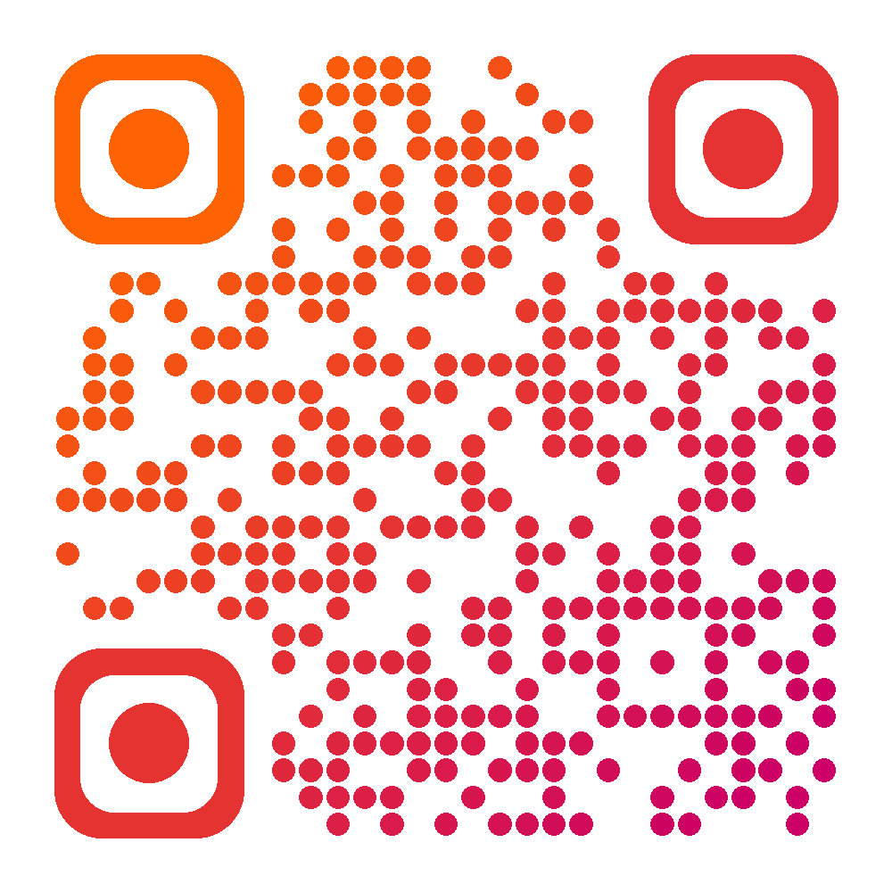
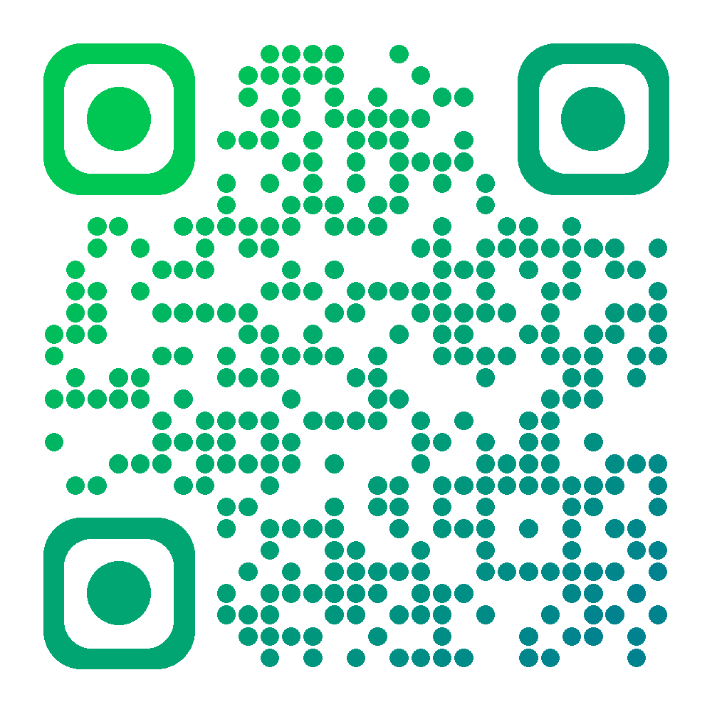
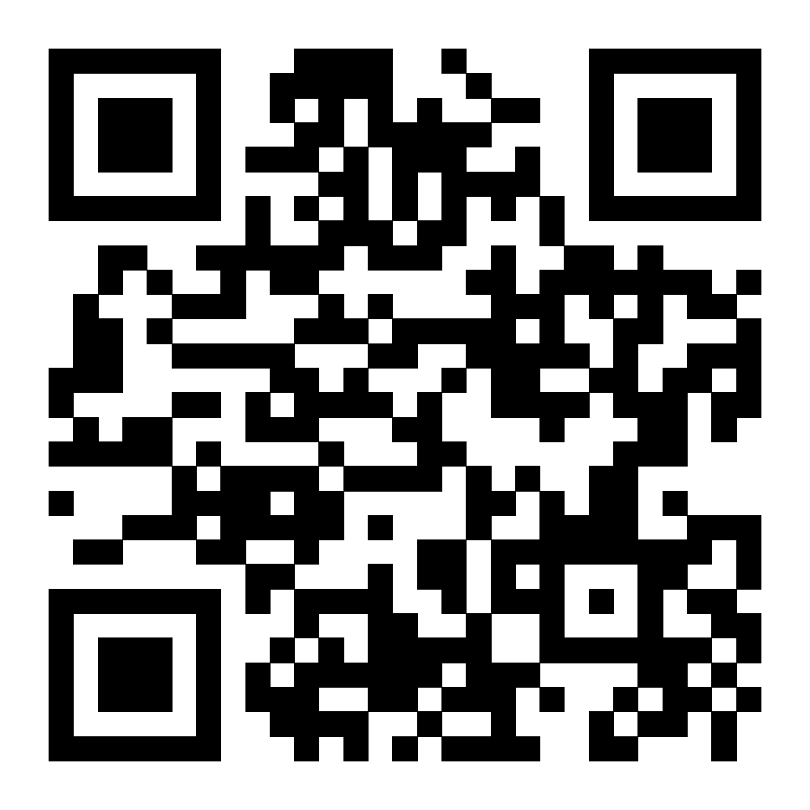
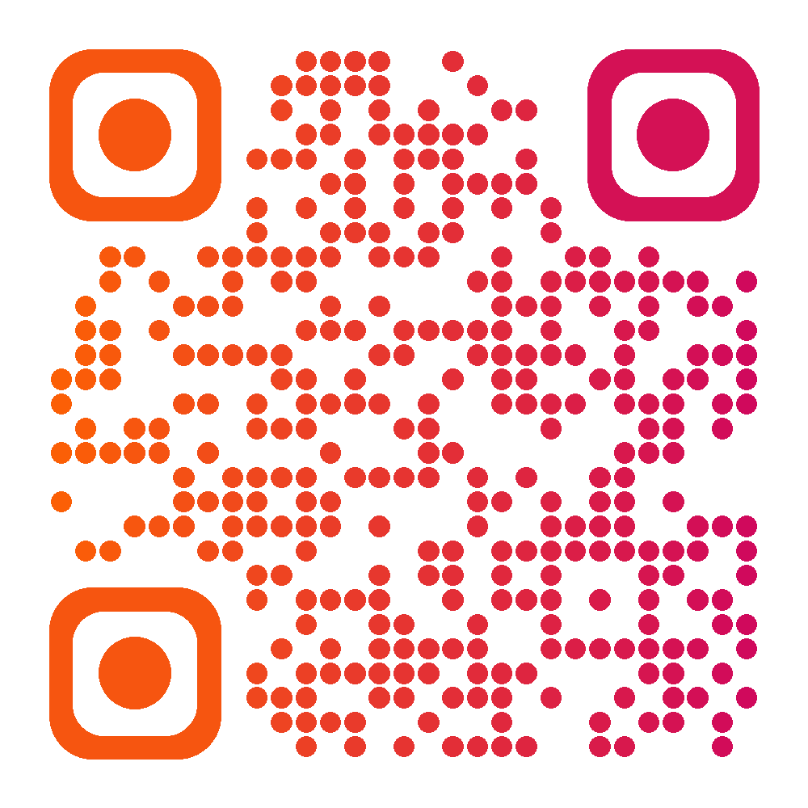

<p align="center">
  
</p>

<h1 align="center">QRCraft</h1>

<p align="center">
  <strong>Beautiful, animated QR codes with gradient fills, custom finder patterns, circular modules, and logo overlays.</strong>
</p>

<p align="center">
  <a href="#features">Features</a> •
  <a href="#installation">Installation</a> •
  <a href="#quick-start">Quick Start</a> •
  <a href="#gallery">Gallery</a> •
  <a href="#api">API</a> •
  <a href="#how-it-works">How It Works</a>
</p>

---

## Features

- **Gradient fills** — smooth two-color diagonal gradient across all modules
- **Custom finder patterns** — rounded squares with circular inner dots
- **Circular modules** — modern dot-style data modules
- **Logo overlay** — center any logo with configurable padding and background
- **Animated GIF** — rotating gradient that loops seamlessly (every frame is scannable)
- **Deterministic** — same inputs always produce the exact same output
- **Single package** — just `qrcode` + `Pillow`, no heavy dependencies
- **CLI + Python API** — use from the command line or import in your code

## Installation

```bash
pip install qrcraft
```

Or install from source:

```bash
git clone https://github.com/salusfintech/qrcraft.git
cd qrcraft
pip install .
```

**Requirements:** Python 3.10+

## Quick Start

### Command Line

```bash
# Default style — gradient, circles, fancy finders
qrcraft "https://example.com" -o my_qr.png

# With a logo
qrcraft "https://example.com" --logo my_logo.png -o branded.png

# Custom colors
qrcraft "https://example.com" \
  --fg-color "#FF6600" --fg-color2 "#CC0066" \
  -o warm_gradient.png

# Animated GIF with rotating gradient
qrcraft "https://example.com" \
  --animate --frames 36 --duration 3.0 \
  -o animated.gif

# Classic flat QR code (disable all styling)
qrcraft "https://example.com" \
  --no-gradient --no-fancy-finders --no-circle-modules \
  -o classic.png
```

### Python API

```python
from qrcraft import generate_qr_matrix, render_qr_image, overlay_logo, generate_animated_gif

# Generate a styled QR code
qr = generate_qr_matrix("https://example.com")
img = render_qr_image(
    qr,
    fg_color=(20, 0, 255),
    fg_color2=(123, 0, 255),
    circle_modules=True,
    fancy_finders=True,
)
img.save("styled.png")

# Add a logo
img = overlay_logo(img, logo_path="logo.png", logo_scale=0.25)
img.save("branded.png")

# Generate animated GIF
generate_animated_gif(
    qr,
    output_path="animated.gif",
    fg_color=(20, 0, 255),
    fg_color2=(123, 0, 255),
    logo_path="logo.png",
    num_frames=36,
    duration_seconds=3.0,
)
```

## Gallery

### Static QR Codes

<table>
<tr>
<td align="center"><br><sub>Blue → Purple gradient</sub></td>
<td align="center"><br><sub>Orange → Magenta gradient</sub></td>
<td align="center"><br><sub>Green → Teal gradient</sub></td>
</tr>
<tr>
<td align="center"><br><sub>With logo (solid bg)</sub></td>
<td align="center"><br><sub>With logo (transparent bg)</sub></td>
<td align="center"><br><sub>Rounded rectangles</sub></td>
</tr>
<tr>
<td align="center"><br><sub>Flat color + circles</sub></td>
<td align="center"><br><sub>Classic (all features off)</sub></td>
<td></td>
</tr>
</table>

### Animated QR Codes

<table>
<tr>
<td align="center"><br><sub>Blue → Purple</sub></td>
<td align="center"><br><sub>Orange → Magenta</sub></td>
</tr>
<tr>
<td align="center"><br><sub>With logo (solid bg)</sub></td>
<td align="center"><br><sub>With logo (transparent bg)</sub></td>
</tr>
</table>

## CLI Reference

```
qrcraft [URL] [OPTIONS]
```

| Option | Default | Description |
|---|---|---|
| `-o, --output` | `qr_output.png` | Output file path |
| **Colors** | | |
| `--fg-color` | `#1400FF` | Primary module color (hex) |
| `--fg-color2` | `#7B00FF` | Secondary gradient color (hex) |
| `--bg-color` | `#FFFFFF` | Background color (hex) |
| **Logo** | | |
| `--logo` | *(none)* | Path to logo image |
| `--logo-scale` | `0.25` | Logo size as fraction of QR (0.0–0.5) |
| `--logo-bg-color` | *(same as bg)* | Background behind logo (hex) |
| `--logo-padding` | `10` | Padding around logo in pixels |
| `--no-logo` | | Skip logo overlay |
| **QR Parameters** | | |
| `--size` | `1000` | Image size in pixels |
| `--border` | `2` | Quiet zone in modules |
| `--error-correction` | `H` | Error correction: L, M, Q, H |
| **Style** | | |
| `--no-gradient` | | Flat color instead of gradient |
| `--no-fancy-finders` | | Standard square finder patterns |
| `--no-circle-modules` | | Square modules instead of circles |
| `--rounded` | | Rounded-rect modules (when circles off) |
| `--round-radius` | `0.4` | Corner radius fraction (0.0–0.5) |
| **Animation** | | |
| `--animate` | | Output animated GIF |
| `--frames` | `36` | Number of frames |
| `--duration` | `3.0` | Loop duration in seconds |

## API

### `generate_qr_matrix(url, error_correction=ERROR_CORRECT_H, border=2)`

Generate a QR code matrix. Returns a `qrcode.QRCode` object.

### `render_qr_image(qr, size=1000, fg_color, bg_color, fg_color2, ...)`

Render a QR matrix to a PIL Image with gradient, circles, and custom finders.

### `overlay_logo(qr_img, logo_path, logo_scale=0.25, ...)`

Overlay a logo in the center of a QR code image. Returns a new PIL Image.

### `generate_animated_gif(qr, output_path, num_frames=36, duration_seconds=3.0, ...)`

Generate an animated GIF with the gradient rotating 360°.

## How It Works

QR codes use **error correction** to remain scannable even when part of the code is damaged or obscured. At level H (the default), up to **30% of modules** can be missing and the code still scans. QRCraft exploits this by:

1. **Circular modules** — still provide dark/light contrast that scanners need
2. **Custom finder patterns** — same position and size as standard ones, just rounded
3. **Logo overlay** — sits in the center where error correction covers it
4. **Gradient colors** — scanners only need sufficient contrast, not specific colors

For **animated QR codes**, each frame is an independently scannable QR code. Only the gradient angle rotates between frames — module positions are fixed. Any frame captured by a camera will scan correctly.

## License

[MIT](LICENSE) — Salus Financial Technology
